# Projeto Ransomware

### Ferramentas

- Kali Linux
- Python
- Nano

### Passo a passo

- Criar pasta do projeto: ``` mkdir projeto-ransomware ```
  - Abrir pasta do projeto: ``` cd projeto_ransomware ```
  - Criar arquivos: ``` touch teste.txt```, ```touch encrypter.py```, ```touch decrypter.py```
  - Listar arquivos da pasta: ```ls```

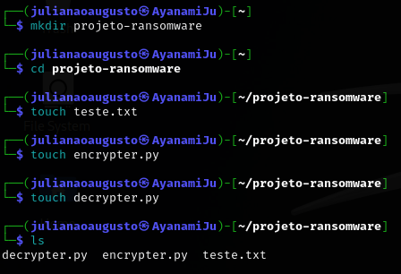

- Abrir o arquivo teste.txt: ``` nano teste.txt ```

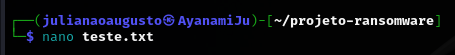

  - Digitar mensagem no arquivo, salvar ( ```Ctrl + O```) e fechar o nano (```Ctrl + X```)

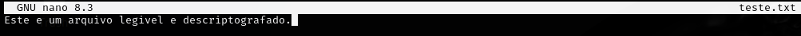

- Abrir o encrypter: ``` nano encrypter.py ```
 
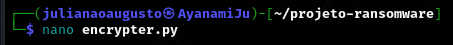

  - Digitar o código para criptografar o arquivo teste.txt, salvar ( ```Ctrl + O```) e fechar o nano (```Ctrl + X```)
   
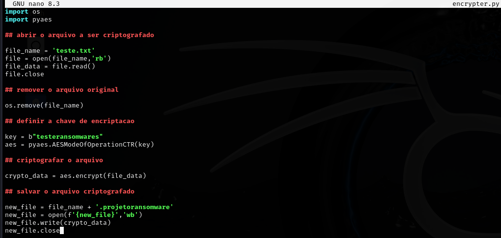

- Rodar o encrypter: ``` python encrypter.py`
  - Listar arquivos da pasta: ``` ls ```

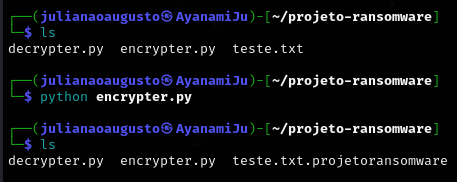

  - Abrir o arquivo criptografado: ``` nano teste.txt.projetoransomware ```

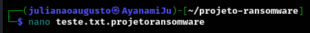

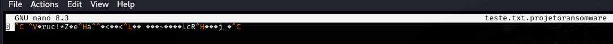

- Abrir o decrypter: ``` nano decrypter.py ```
 
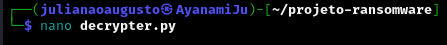

  - Digitar o código para descriptografar o arquivo teste.txt.projetoransomware, salvar ( ```Ctrl + O```) e fechar o nano (```Ctrl + X```)
   
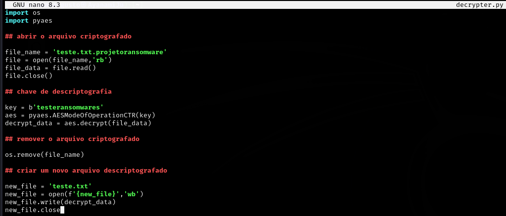

- Rodar o decrypter: ``` python decrypter.py```
  - Listar arquivos da pasta: ``` ls ```

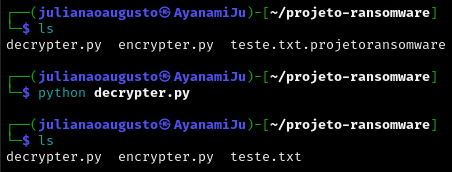

  - Abrir o arquivo descriptografado: ``` nano teste.txt ```

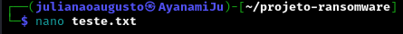

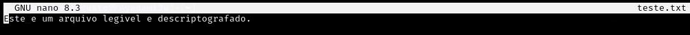

### Resultados

- Arquivo criptografado


- Arquivo descriptografado


